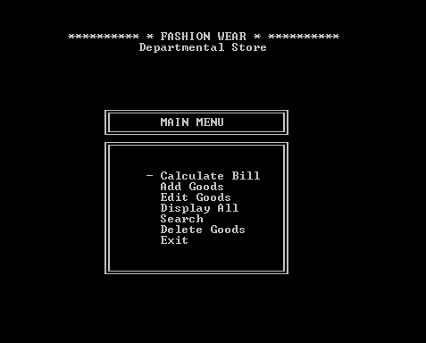
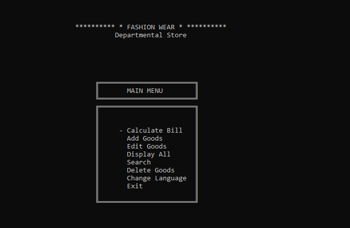
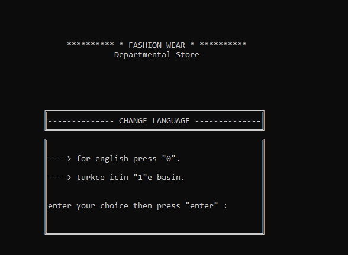
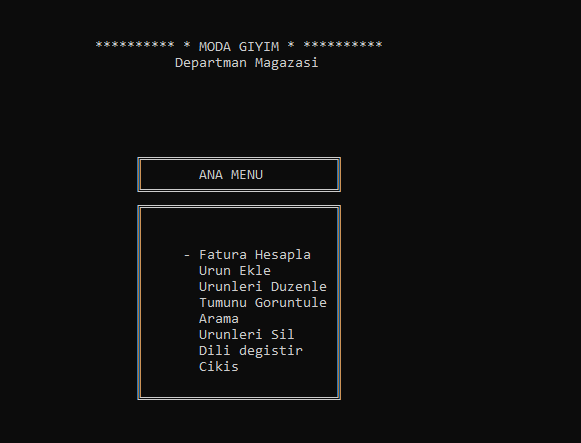
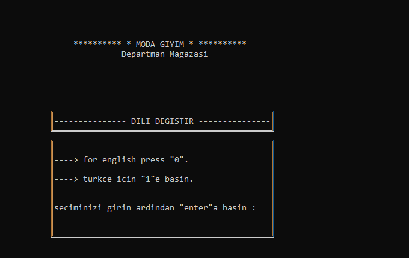

# CE103 Algorithms and Programming I Homework 3

In this problem you will upgrade an existing app and you will add multi language support for a console application. This application will provide **Turkish** and **English** languages. Sentences on the screen will be stored on files. For example English words or sentences will be stored on **en.dat** and Turkish sentences and words will be stored in **tr.dat**. There will be configuration file **lang.dat** to keep language selection for user. If language is English then **en.dat** file content will be used otherwise **tr.dat** file will be used. 
You will use the following working example “**DepartmentStoreManagementSystem**” and one more menu option for language selection such as “Change Language” to following list. 
In the first time and run default will be Turkish language and if there is no selection for first time you will create default **lang.dat** for Turkish, then user can edit language from “*Change Language*” menu by selection with <u>arrow keys (up or down) as below</u>.
There is language example that you can use similar features for this homework “**LocalizationExample**”. 

Your application will have following menu items and actions

"Change Language"  menu item

Option for Turkish and English selection

Dynamic update after selection

Then you can try again

# References

[50+ Interesting Programming C Projects Download With Source Code](https://learnprogramo.com/50-interesting-programming-c-projects-download-with-source-code/)
